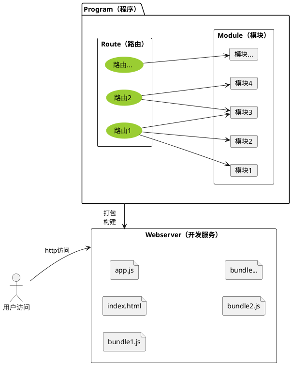
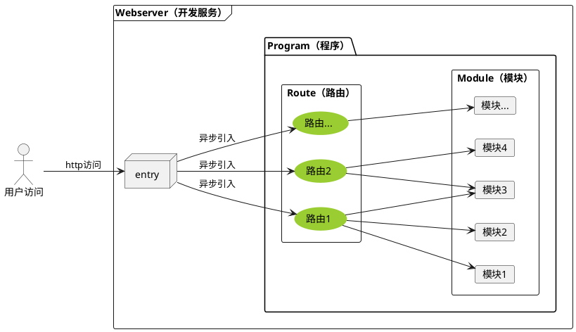

# Build

<!-- webpack等方式构建的开发服务 -->

```plantuml
@startuml
' skinparam handwritten true
skinparam sequenceMessageAlign center
skinparam componentStyle rectangle

skinparam usecase {
  BackgroundColor YellowGreen
  BorderColor YellowGreen
}

left to right direction
package Program（程序） as program {
  component Route（路由） as route {
    card (路由1) as (route1)
    card (路由2) as (route2)
    card (路由...) as (route_other)
  }
  component Module（模块） as module {
    card 模块1 as module1
    card 模块2 as module2
    card 模块3 as module3
    card 模块4 as module4
    card 模块... as module6
  }
}

' node 编译 as bundle
component Webserver（开发服务）as server {
  file index.html
  file app.js
  file bundle1.js
  file bundle2.js
  file bundle...
}
actor 用户访问 as user

route1-->module1
route1-->module2
route1-->module3
route2-->module3
route2-->module4
route_other-->module6

' module --[hidden]> server : 编译
' program-[#green;thickness=8]left-> server : 编译
program-left-> server : 打包\n构建\n
' bundle-right->server
' server-up-> user : 资源返回
user -left-> server : http访问
user--[hidden]>bundle1.js


' route --[hidden]> server

@enduml
```

<!-- vite构建的开发服务 -->

```plantuml
@startuml
skinparam sequenceMessageAlign center
skinparam componentStyle rectangle

skinparam usecase {
  BackgroundColor YellowGreen
  BorderColor YellowGreen
}
left to right direction
' top to bottom direction
frame Webserver（开发服务）as server {
  package Program（程序） as program {
    component Route（路由） as route {
      card (路由1) as (route1)
      card (路由2) as (route2)
      card (路由...) as (route_other)
    }
    component Module（模块） as module {
      card 模块1 as module1
      card 模块2 as module2
      card 模块3 as module3
      card 模块4 as module4
      card 模块... as module6
    }
  }

  node entry as entry
}
actor 用户访问 as user

route1-->module1
route1-->module2
route1-->module3
route2-->module3
route2-->module4
route_other-->module6

user --> entry : http访问

entry-->route1 : ""异步引入""

entry-->route2 : ""异步引入""

entry-->route_other : ""异步引入""


@enduml
```