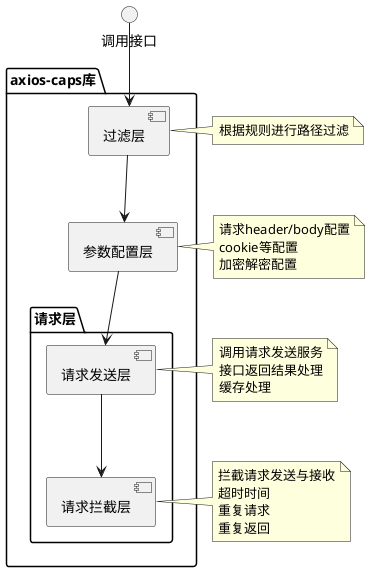

```plantuml
@startuml

interface "调用接口" as actor

package "axios-caps库" as main {
  [过滤层] as filter
  [参数配置层] as params

  package "请求层" as http { 
    [请求发送层] as request
    [请求拦截层] as interceptors
  }
}

note right of filter
  根据规则进行路径过滤
end note

note right of params
  请求header/body配置
  cookie等配置
  加密解密配置
end note

note right of request
  调用请求发送服务
  接口返回结果处理
  缓存处理
end note

note right of interceptors
  拦截请求发送与接收
  超时时间
  重复请求
  重复返回
end note


actor --> filter

filter --> params

params --> request

request --> interceptors


@enduml
```