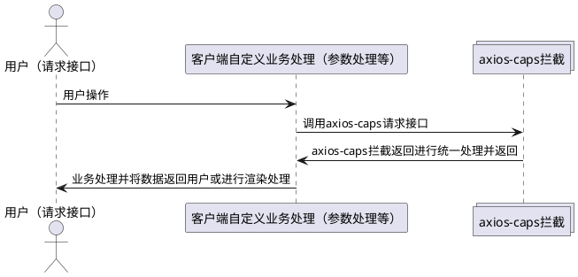

```plantuml
@startuml
actor       "用户（请求接口）"       as actor
participant "客户端自定义业务处理（参数处理等）" as client
collections "axios-caps拦截"   as request

actor -> client : 用户操作
client -> request : 调用axios-caps请求接口

request -> client : axios-caps拦截返回进行统一处理并返回
client -> actor : 业务处理并将数据返回用户或进行渲染处理
@enduml
```